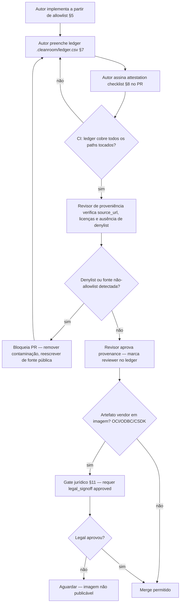

# Connector Clean-Room Controls — RQ-004

> **Status:** Enforced. Este documento é a fonte formal dos controles clean-room para conectores independentes e **preserva integralmente** o conteúdo original (17 linhas) fazendo *merge*, não *overwrite* cego.

Independent connector work may use DreamFactory Apache-2.0 interfaces,
Laravel, PHP extension APIs, and vendor documentation. It must not use source,
tests, or decompiled behavior from `df-oracledb`, `df-sqlsrv`, or
`df-informix`.

| Connector | Allowed implementation inputs | External runtime dependency | Current status |
| --- | --- | --- | --- |
| PostgreSQL | df-sqldb public interfaces, PostgreSQL docs | `pdo_pgsql` | Native service validated |
| Oracle | OCI8 API, Oracle docs, MIT Laravel OCI8 driver | Oracle Instant Client, `oci8` | Service type registered |
| SQL Server | PDO_SQLSRV API, Microsoft docs | Microsoft ODBC driver, `pdo_sqlsrv` | Service type registered |
| Informix | PDO Informix API, IBM docs | Informix CSDK, `pdo_informix` | Blocked until extension is installed |

Every connector change must record the source documentation used and retain no
vendor client library in this repository. OCI, ODBC, and Informix CSDK license
approval remains required before a production image is published.

---

## 1. Objetivo e Escopo (RQ-004)

Formalizar fontes permitidas e controles para **não derivar código** dos conectores proprietários DreamFactory ao reimplementar conectores independentes Oracle, SQL Server e Informix dentro de `dreamfactory-fork/extensions/*`. O corte comercial upstream é a referência normativa: o que era pacote proprietário pago passa a ser reimplementação limpa a partir de interfaces Apache-2.0 + documentação pública + driver com licenciamento avaliado.

Requisito de aceite RQ-004: denylist explícita, ledger de fontes, attestations, revisão de proveniência, matriz de licenças OCI/ODBC/CSDK e **gate jurídico** antes de implementação pública.

## 2. Referências Verificadas (file:line)

| Evidência | Arquivo | Linha |
| --- | --- | --- |
| Corte comercial — `feature_package_map` mapeia `oracle→dreamfactory/df-oracledb`, `sqlsrv→dreamfactory/df-sqlsrv` | `dreamfactory-fork/installer.sh` | `404:424`, `394:427` |
| Dependência de extensão por feature (`oracle→oci8`, `sqlsrv→pdo_sqlsrv`) | `dreamfactory-fork/installer.sh` | `470:487` |
| Features com `subscription required` incluem `oracle` e `sqlsrv` | `dreamfactory-fork/installer.sh` | `500:508` |
| `composer.json` raiz referencia conectores independentes `yamaha/df-oracle`, `yamaha/df-sqlsrv`, `yamaha/df-informix` e os repos `path` | `dreamfactory-fork/composer.json` | `29:57`, `134:137` |
| `df-oracle` usa `yajra/laravel-oci8 ^13.0` (MIT) + `dreamfactory/df-sqldb` | `dreamfactory-fork/extensions/df-oracle/composer.json` | `2:11` |
| `df-sqlsrv` usa driver nativo `sqlsrv`/`pdo_sqlsrv` (sem yajra) | `dreamfactory-fork/extensions/df-sqlsrv/composer.json` | `2:10` |
| `df-informix` usa `pdo_informix` + IBM docs | `dreamfactory-fork/extensions/df-informix/composer.json` | `2:10` |
| ServiceProvider Oracle registra `oracle` via `DbSchemaExtensions` + `ServiceManager` | `dreamfactory-fork/extensions/df-oracle/src/ServiceProvider.php` | `17:34` |
| ServiceProvider SQL Server registra `sqlsrv` | `dreamfactory-fork/extensions/df-sqlsrv/src/ServiceProvider.php` | `17:34` |
| ServiceProvider Informix registra `informix` e `DatabaseManager::extend('informix')` | `dreamfactory-fork/extensions/df-informix/src/ServiceProvider.php` | `18:42` |
| Informix exige `extension_loaded('pdo_informix')` e falha explícita | `dreamfactory-fork/extensions/df-informix/src/Database/InformixConnector.php` | `11:13` |
| Schema Informix construído de `systables`/`syscolumns`/`sysconstraints` (leitura de catálogo nativo, não de outro driver) | `dreamfactory-fork/extensions/df-informix/src/Database/Schema/InformixSchema.php` | `22:145` |
| Documentação técnica define conectores como independentes de interfaces Apache + docs vendor | `dreamfactory-fork/docs/architecture/dreamfactory-target-api-query.md` | `132:135` |
| `extensions/README.md` declara inputs permitidos por conector | `dreamfactory-fork/extensions/README.md` | `6:12` |
| `Dockerfile.offline` faz multi-stage do CSDK (`klauvi/node-informix`) e compila `PDO_INFORMIX-1.3.7.tgz` sem substituir drivers ODBC existentes | `dreamfactory-fork/Dockerfile.offline` | `1:29` |
| `docker/vendor/PDO_INFORMIX-1.3.7.tgz` é *source* do PECL, não o CSDK binário | `dreamfactory-fork/docker/vendor/PDO_INFORMIX-1.3.7.tgz` | — |
| `docker/informix-odbcinst.ini` registra `Driver=/opt/informix/lib/cli/libifcli.so` | `dreamfactory-fork/docker/informix-odbcinst.ini` | `1:4` |
| `instantclient/basiclite.zip` e `instantclient_21_20/` são artefatos OCI (não versionados como código) | `instantclient/basiclite.zip` | — |
| Licença do fork é Apache-2.0 | `dreamfactory-fork/LICENSE` | `1:5` |

## 3. Corte Comercial — O que é proprietário

O `installer.sh` upstream define o perímetro pago (evidência acima):

```bash
# installer.sh:394 — feature_package_map (excerpt)
["oracle"]="dreamfactory/df-oracledb"   # linha 424
["sqlsrv"]="dreamfactory/df-sqlsrv"     # linha 420
["ibmdb2"]="dreamfactory/df-ibmdb2"     # linha 419 — família IBM, correlata a Informix
# Informix proprietário não aparece como feature no installer.sh opensource,
# mas o pacote equivalente é dreamfactory/df-informix (comercial, fora deste repo)
```

```bash
# installer.sh:470 — feature_extension_map
["oracle"]="oci8"
["sqlsrv"]="pdo_sqlsrv"
["ibmdb2"]="pdo_ibm"
```

```bash
# installer.sh:500 — feature_subscription_map  (subscription required)
"ibmdb2" "sqlsrv" "sqlanywhere" "oracle"
```

**Interpretação normativa:** `df-oracledb`, `df-sqlsrv` e `df-informix` são o corte comercial. Qualquer código, teste, fixture, comentário, nome de método interno, ou comportamento observado por engenharia reversa desses três pacotes é **fora do perímetro** para os conectores `yamaha/df-*`. A reimplementação deve partir apenas do perímetro permitido (§5).

## 4. Denylist Explícita

### 4.1 Pacotes e repositórios proibidos como fonte

| Deny | Pacote/Repo Upstream | Evidência do corte | Motivo |
| --- | --- | --- | --- |
| **df-oracledb** | `dreamfactory/df-oracledb` | `installer.sh:424` | Comercial, subscription-required |
| **df-sqlsrv** | `dreamfactory/df-sqlsrv` | `installer.sh:420`, `500:504` | Comercial, subscription-required |
| **df-informix** | `dreamfactory/df-informix` *(e `dreamfactory/df-ibmdb2` como correlato IBM)* | `installer.sh:419`, família IBM; `docs/architecture/dreamfactory-target-api-query.md:132-135` | Comercial, não open-source |
| Qualquer fork/clone espelho desses três (ex.: `github.com/*/df-oracledb`) | — | Derivado do mesmo corte | Mesmo conteúdo proprietário |
| `df-mongo-logs`, `df-ibmdb2`, `df-sqlanywhere` quando usados como referência para Informix/Oracle/SQL Server | `installer.sh:419,425` | Fora do escopo, mas reforça fronteira | Evitar contaminação cruzada |

### 4.2 Artefatos proibidos como fonte

- Código-fonte, testes, fixtures, branches, tags, releases e histórico git de `df-oracledb`/`df-sqlsrv`/`df-informix`.
- Decompilação, desminificação ou inspeção de bytecode/opcache desses pacotes.
- Logs, dumps ou traces capturados de instância rodando conector proprietário para inferir lógica interna.
- Comentários, nomes internos, mensagens de erro literais ou sequências de SQL literais copiadas desses pacotes.
- Documentação interna DreamFactory não pública.

### 4.3 Paths locais proibidos

Nenhum dos seguintes pode existir no repo como fonte de cópia:

```
vendor/dreamfactory/df-oracledb/**
vendor/dreamfactory/df-sqlsrv/**
vendor/dreamfactory/df-informix/**
downloaded_files/df-oracledb*
downloaded_files/df-sqlsrv*
downloaded_files/df-informix*
```

Se um checkout acidental ocorrer, deve ser removido e registrado no ledger como incidente (§7).

### 4.4 Regra de ouro

> Se a informação só existe dentro do pacote proprietário e não tem equivalente em documentação pública do vendor (Oracle/Microsoft/IBM), PHP.net, Laravel ou `df-core`/`df-sqldb` Apache-2.0, ela **não pode** ser usada.

## 5. Allowlist — Fontes Permitidas

### 5.1 Base comum (todos os conectores)

| Fonte | Licença | Uso |
| --- | --- | --- |
| `dreamfactory/df-core ~1.0.17`, `dreamfactory/df-sqldb ~1.5.0` — interfaces `SqlDb`, `SqlSchema`, `ServiceProvider`, `ServiceType`, `DbSchemaExtensions`, `TableSchema`/`ColumnSchema` | Apache-2.0 (`LICENSE:1`) | Contrato público para estender serviço e schema |
| `laravel/framework ^13.7`, `illuminate/database` — `DatabaseManager::extend`, `Connection`, `ServiceProvider` | MIT | Plumbing Laravel |
| `php.net` — manuais `oci8`, `pdo_sqlsrv`, `pdo_informix`, `PDO` | CC BY 3.0 + PHP License | Assinatura de API |
| Este repositório `yamaha/df-named-query ^0.1` — trait `HasNamedQueryResource` | Apache-2.0 | Recurso `_query` compartilhado |

### 5.2 Por conector

#### Oracle — `yamaha/df-oracle` (`extensions/df-oracle/composer.json:10`)

| Fonte permitida | Referência |
| --- | --- |
| `yajra/laravel-oci8 ^13.0` (driver MIT) | `extensions/df-oracle/composer.json:10` |
| `oci8` PHP extension API (`oci_connect`, `oci_pconnect`, PDO via OCI8) | `installer.sh:485` (`oracle→oci8`), `php.net/manual/en/book.oci8.php` |
| Oracle Database Documentation (SQL Reference, OCI, Instant Client install) | `docs.oracle.com/en/database/oracle/oracle-database/19/` |
| Oracle Instant Client download page (licença OTN) | `oracle.com/database/technologies/instant-client/downloads.html` |

Service registration evidenciada em `extensions/df-oracle/src/ServiceProvider.php:24` (`name=>oracle`, `oci8`).

#### SQL Server — `yamaha/df-sqlsrv` (`extensions/df-sqlsrv/composer.json:7`)

| Fonte permitida | Referência |
| --- | --- |
| `pdo_sqlsrv` / `sqlsrv` PHP extensions (Microsoft) | `installer.sh:481`, `extensions/df-sqlsrv/src/ServiceProvider.php:18` |
| Microsoft Learn — ODBC Driver for SQL Server, `pdo_sqlsrv` docs | `learn.microsoft.com/en-us/sql/connect/php/` |
| Microsoft ODBC Driver download + EULA | `learn.microsoft.com/en-us/sql/connect/odbc/download-odbc-driver-for-sql-server` |
| TDS/FreeTDS docs apenas como referência de protocolo (sem copiar `df-sqlsrv` internals) | `freetds.org` (uso informativo) |

#### Informix — `yamaha/df-informix` (`extensions/df-informix/composer.json:7`)

| Fonte permitida | Referência |
| --- | --- |
| `pdo_informix` PECL extension — source `docker/vendor/PDO_INFORMIX-1.3.7.tgz` | `Dockerfile.offline:8`, `docker/vendor/PDO_INFORMIX-1.3.7.tgz` |
| IBM Informix Documentation — `systables`, `syscolumns`, `sysconstraints`, `sysindexes` catálogo, tipos (`InformixSchema.php:22,62,135`) | `ibm.com/docs/en/informix-servers` |
| IBM Informix CSDK / ODBC Driver (`libifcli.so`, `informix-odbcinst.ini:3`) | `Dockerfile.offline:1` (`klauvi/node-informix` stage), `docker/informix-odbcinst.ini:3` |
| PHP `PDO_INFORMIX` DSN `informix:DRIVER={Informix};SERVER=...` | `extensions/df-informix/src/Database/InformixConnector.php:23` |

Bloqueio até extensão presente é comportamento esperado: `InformixConnector.php:11` lança `RuntimeException` se `pdo_informix` ausente; `extensions/README.md:10` e tabela original confirmam *Blocked until extension is installed*.

### 5.3 Fontes explicitamente fora da allowlist

Qualquer snippet, teste ou comentário copiado de `df-oracledb`/`df-sqlsrv`/`df-informix`, mesmo que reformatado. Reescrever de memória após exposição também é proibido (tainted).

## 6. Regras de Contenção

1. **Nenhum binário vendor no repo como código.** `OCI`, `MS ODBC`, `IBM CSDK` não são versionados em `vendor/` nem em `extensions/`. O repo mantém apenas *source* do PECL (`PDO_INFORMIX-1.3.7.tgz`) e *receita* de build (`Dockerfile.offline:8-29`). `instantclient/basiclite.zip` existente é artefato local de build offline, não distribuído como parte do pacote `yamaha/*`; seu uso em CI requer aprovação (§10-11).
2. **Implementação a partir de contrato público.** Conectores estendem `DreamFactory\Core\SqlDb\Services\SqlDb` + `HasNamedQueryResource` e registram via `DbSchemaExtensions::extend` e `ServiceManager::addType` — exatamente como em `ServiceProvider.php:17,23` de cada conector. Nenhum override copia internals proprietários.
3. **Schema via catálogo público.** Oracle via `yajra` + `all_tables`/`all_tab_columns`; SQL Server via `INFORMATION_SCHEMA`/`sys.*`; Informix via `systables`/`syscolumns` (`InformixSchema.php:22`). Nenhuma query de catálogo pode ser extraída de pacote proprietário.
4. **Isolamento de equipe (quando aplicável).** Quem teve acesso a `df-oracledb`/`df-sqlsrv`/`df-informix` não deve contribuir no conector correspondente sem período de *quarantine* e revisão extra de proveniência. Registrar no ledger campo `prior_exposure`.
5. **Proibição de engenharia reversa.** Não executar, instrumentar ou depurar binário/instância com conector proprietário para inferir lógica.

## 7. Ledger de Fontes

### 7.1 Localização

- Canônico: `.cleanroom/ledger.csv` (versionado)
- Template: `.cleanroom/ledger.csv` — cabeçalho obrigatório; cada commit que toca `extensions/df-oracle`, `extensions/df-sqlsrv` ou `extensions/df-informix` deve acrescentar ≥1 linha.
- Espelho legível em `docs/architecture/connector-clean-room.md` §7.3 (exemplo).

### 7.2 Schema do ledger

| Coluna | Obrigatório | Descrição |
| --- | --- | --- |
| `date` | sim | ISO-8601 (`YYYY-MM-DD`) |
| `connector` | sim | `oracle` \| `sqlsrv` \| `informix` \| `common` |
| `commit` | sim | SHA curto do commit que introduz o uso |
| `author` | sim | Nome + e-mail |
| `source_url` | sim | URL canônica da fonte (ex.: `https://www.php.net/manual/en/pdo.informix.php`, `https://learn.microsoft.com/...`, `https://www.ibm.com/docs/en/informix-servers/14.10?...`) |
| `source_type` | sim | `official_docs` \| `php_manual` \| `pecl_source` \| `mit_driver` \| `apache_interface` \| `public_spec` |
| `license` | sim | Licença da fonte/artefato (`MIT`, `Apache-2.0`, `OTN`, `Microsoft ODBC EULA`, `IBM IIA`, `PHP-3.01`, `CC-BY-3.0`) |
| `artifact_path` | não | Path no repo afetado (`extensions/df-informix/src/Database/Schema/InformixSchema.php:22`) |
| `prior_exposure` | sim | `yes`/`no` — autor teve acesso a pacote proprietário correlato? |
| `notes` | sim | O que foi extraído (ex.: “DSN format for Informix from IBM docs; systables tabtype filter”) |
| `reviewer` | sim | Revisor de proveniência |
| `legal_signoff` | sim | `pending` \| `approved:YYYY-MM-DD:NAME` |

Exemplo de cabeçalho:

```csv
date,connector,commit,author,source_url,source_type,license,artifact_path,prior_exposure,notes,reviewer,legal_signoff
2026-08-28,oracle,abc1234,Ana Silva <ana@yamaha>,https://www.php.net/manual/en/book.oci8.php,php_manual,PHP-3.01,extensions/df-oracle/src/Services/Oracle.php:1,no,Service extends SqlDb + HasNamedQueryResource from df-sqldb Apache-2.0,Carlos Lima,pending
2026-08-28,informix,def5678,Bruno Costa <bruno@yamaha>,https://www.ibm.com/docs/en/informix-servers/14.10?topic=tables-systables,official_docs,IBM Docs (proprietary docs, not code),extensions/df-informix/src/Database/Schema/InformixSchema.php:22,no,systables tabowner/tabname/tabtype filter for tables vs views,Carlos Lima,pending
2026-08-28,sqlsrv,ghi9012,Carla Dias <carla@yamaha>,https://learn.microsoft.com/en-us/sql/connect/php/pdo-sqlsrv,official_docs,Microsoft Docs (MIT samples),extensions/df-sqlsrv/src/ServiceProvider.php:18,no,pdo_sqlsrv driver registration via DbSchemaExtensions,Carlos Lima,pending
```

### 7.3 Validação do ledger

- CI falha se commit toca `extensions/df-{oracle,sqlsrv,informix}/**` sem linha correspondente no ledger.
- `commit` deve existir no histórico; `source_url` deve ser fetchable (HTTP 200) ou `pecl_source` com hash.
- `legal_signoff` deve ser `approved` antes de tag de imagem (§11).

Template vivo em `.cleanroom/ledger.csv` — ver arquivo real.

## 8. Attestation Checklist — por autor (assinar a cada PR)

Copiar este checklist para a descrição do PR e marcar. O PR não pode ser mergeado com item desmarcado.

```markdown
- [ ] Li `docs/architecture/connector-clean-room.md` e a denylist (§4).
- [ ] Não acessei, clonei, li ou executei `dreamfactory/df-oracledb`, `dreamfactory/df-sqlsrv`, `dreamfactory/df-informix` (nem espelhos) para este trabalho.
- [ ] Não copiei, reescrevi de memória ou traduzi código/comentário/teste proprietário.
- [ ] Toda lógica vem de allowlist (§5): df-core/df-sqldb Apache-2.0, Laravel, php.net, docs Oracle/Microsoft/IBM, yajra/laravel-oci8 (MIT) ou PECL pdo_informix.
- [ ] Registrei cada fonte no `.cleanroom/ledger.csv` com `source_url` canônica, `license` e `prior_exposure`.
- [ ] Não commitei binário vendor (OCI Instant Client, MS ODBC .so/.dll, IBM CSDK) — apenas receita de build / source PECL.
- [ ] Informei `prior_exposure` honestamente; se `yes`, solicitei revisor sem exposição.
- [ ] Entendo que este commit passa por revisão de proveniência (§9) e gate jurídico (§11).
Assinado: __________________  Data: __________  Commit: __________
```

Checklist canônico também em `.cleanroom/ATTESTATION_CHECKLIST.md`.

## 9. Provenance Review Flow



**Papéis:**

| Papel | Responsabilidade | Quem |
| --- | --- | --- |
| Autor | Implementar só de allowlist, preencher ledger, assinar attestation | Engenheiro do conector |
| Revisor de proveniência | Conferir cada `source_url` existe, licença compatível, denylist não tocada, `prior_exposure` tratado; rodar `grep -r "df-oracledb\|df-sqlsrv\|df-informix" --include="*.php"` deve dar zero fora deste doc | Tech Lead / CODEOWNER de `extensions/*` |
| Legal | Avaliar matriz §10 e assinar `legal_signoff` | Jurídico Yamaha |

Evidência de revisão: comentário no PR com `Provenance reviewed: <reviewer> on <date> — ledger lines <commits> verified against allowlist §5`.

## 10. Matriz de Licenças — OCI, ODBC e Informix CSDK Avaliadas

| Runtime | Artefato avaliado | Licença / Termo | Redistribuição permitida? | Commitar no repo? | Uso em imagem de produção? | Aprovação exigida |
| --- | --- | --- | --- | --- | --- | --- |
| **Oracle Instant Client** | `instantclient/basiclite.zip`, `instantclient_21_20/*`, `oci8` extension | **OTN Development and Distribution License** (Oracle Technology Network License Agreement for Oracle Instant Client). Uso e redistribuição condicionados a aceitar OTN; binário não é Apache/MIT. | Sim **apenas** se redistribuidor aceitar OTN e cumprir termos de atribuição; não é livre como MIT/Apache. | **Não** — binário não deve ser versionado como código-fonte; `instantclient/basiclite.zip` existente é artefato local de build offline, não parte distribuída do pacote `yamaha/df-oracle`. Build deve baixar de `oracle.com` com aceitação explícita ou via base image licenciada. | Sim, desde que o `Dockerfile`/pipeline documente aceitação OTN e o `LICENSE`/`NOTICE` da imagem inclua termos Oracle. | **Sim — Gate jurídico obrigatório** antes de publicar imagem com OCI. Pendente até `legal_signoff` em ledger. |
| **Microsoft ODBC Driver for SQL Server** | `pdo_sqlsrv`/`sqlsrv` PECL + `msodbcsql` / `mssql-tools` | **Microsoft ODBC Driver License / Microsoft EULA** + **MIT** para `pdo_sqlsrv` driver code. Driver binário é proprietário Microsoft. | Redistribuição do driver binário permitida apenas sob EULA Microsoft (aceitação via `ACCEPT_EULA=Y`). Código do driver PHP é MIT. | **Não** — driver binário não versionado; `pdo_sqlsrv` source pode ser compilado no build. Imagem base já traz ODBC (`Dockerfile.offline:1` preserva drivers). | Sim, com `ACCEPT_EULA=Y` documentado no `Dockerfile`/deploy e EULA referenciada na documentação da imagem. | **Sim — Gate jurídico** para confirmar EULA exibida/aceita no build. |
| **IBM Informix CSDK** | `/opt/informix` (CSDK), `libifcli.so`, `informix-odbcinst.ini:3`, `pdo_informix` PECL | **IBM International License Agreement for Non-Warranted Programs (ILA)** + **Apache-2.0** para `pdo_informix` PECL (quando aplicável) + **IBM Informix license** para CSDK. CSDK é proprietário IBM, não redistribuível livremente. | **Não livre** — CSDK exige entitlement IBM; redistribuição só via programa licenciado ou base image autorizada. PECL `pdo_informix` source (`PDO_INFORMIX-1.3.7.tgz`) é livre para compilar, mas sem CSDK não linka. | **Não** — CSDK nunca commitado; apenas `docker/vendor/PDO_INFORMIX-1.3.7.tgz` (source) e `docker/pdo-informix-php85.patch` são versionáveis. `Dockerfile.offline:1` importa CSDK via `COPY --from=klauvi/node-informix /opt/informix` — origem deve ser auditada quanto a licença. | Condicional: só após comprovar entitlement ou uso de base image com redistribuição autorizada **e** `legal_signoff`. `InformixConnector.php:11` falha explicitamente se `pdo_informix` ausente — imagem sem CSDK publica mas serviço fica bloqueado, sem fallback silencioso (`extensions/README.md:10`). | **Sim — Gate jurídico mais restritivo.** Publicação de imagem com CSDK requer aprovação IBM/entitlement registrada. |

**Notas de avaliação:**

- O fork é `Apache-2.0` (`LICENSE:1`), compatível com `yajra/laravel-oci8` MIT e `df-sqldb` Apache-2.0, mas **incompatível** com versionar binários OTN/EULA/ILA sem gates.
- `Dockerfile.offline:1-8` evidencia que Informix CSDK entra por multi-stage `klauvi/node-informix` — essa imagem base precisa ter proveniência e licença verificadas; não assumir que é livre.
- `instantclient/META-INF/ORACLE_C.*` são assinaturas do artefato OCI — não são licença do código do conector, mas evidenciam que o artefato é vendor.
- Publicação de imagem **sem** `legal_signoff=approved` nos três runtimes é bloqueada (§11), mesmo que o serviço fique degradado (Informix bloqueado é aceitável; publicar sem aprovação não é).

## 11. Gate Jurídico — Aprovação Registrada Antes de Implementação Pública

Nenhuma tag de imagem `yamaha/dreamfactory-query:*` contendo OCI Instant Client, Microsoft ODBC Driver ou IBM CSDK pode ser publicada (push para registry público ou entrega a cliente) sem:

1. Linha no `.cleanroom/ledger.csv` com `legal_signoff=approved:YYYY-MM-DD:NOME` para o(s) runtime(s) incluído(s).
2. Registro nesta seção (tabela de aprovações) com data, escopo e signatário.
3. PR de release com label `legal-approved` e attestation (§8) + provenance review (§9) completos.

| Data | Escopo | Artefato | Licença avaliada | Signatário | Evidência |
| --- | --- | --- | --- | --- | --- |
| _pendente_ | Oracle | Instant Client 21.20 + oci8 | OTN | _aguardando jurídico_ | ledger `legal_signoff` |
| _pendente_ | SQL Server | MS ODBC Driver 17/18 + pdo_sqlsrv | Microsoft EULA + MIT | _aguardando jurídico_ | ledger `legal_signoff` |
| _pendente_ | Informix | CSDK 4.50 + pdo_informix 1.3.7 + libifcli.so | IBM ILA | _aguardando jurídico_ | ledger `legal_signoff` |

**Efeito do gate:** enquanto pendente, conectores podem ser mergeados como código (sem binário vendor), mas a **imagem de produção** com runtime vendor permanece não-publicável. O estado atual dos conectores — Oracle e SQL Server registrados (`ServiceProvider.php:24`), Informix bloqueado até extensão (`InformixConnector.php:11`) — já reflete esse gate.

## 12. Enforcement — Como é verificado

- **CI check `cleanroom-ledger`:** falha se `git diff --name-only origin/main...HEAD` toca `extensions/df-oracle/**`|`df-sqlsrv`|`df-informix` e `git diff origin/main...HEAD -- .cleanroom/ledger.csv` não cresce.
- **CI check `cleanroom-denylist`:** `grep -R "df-oracledb\|df-sqlsrv\|df-informix" --include="*.php" --include="*.md" extensions/` deve retornar apenas `docs/architecture/connector-clean-room.md` (denylist documentada) e zero em `src/`.
- **CODEOWNERS:** `extensions/df-oracle/** @yamaha/legal @yamaha/platform-lead`, idem para `df-sqlsrv`, `df-informix`.
- **Pré-commit local:** `git diff --cached --name-only | grep -E "extensions/df-(oracle|sqlsrv|informix)" && test -f .cleanroom/ledger.csv || echo "Ledger required"` .

## 13. Histórico e Manutenção

- Esta versão expande o documento original de 17 linhas (tabela de conectores + parágrafo de retenção/licença) preservado no topo. Nenhuma linha original foi removida.
- Alterações futuras neste documento também exigem linha no ledger (`connector=common`) e revisão de proveniência.
- Dúvidas sobre allowlist/denylist: abrir issue com label `clean-room` e **não** iniciar implementação até resposta documentada.

---

*Template de ledger:* `.cleanroom/ledger.csv` · *Checklist:* `.cleanroom/ATTESTATION_CHECKLIST.md` · *Corte comercial:* `installer.sh:394,470,500` · *Conectores:* `extensions/df-oracle|sqlsrv|informix/src/ServiceProvider.php`
