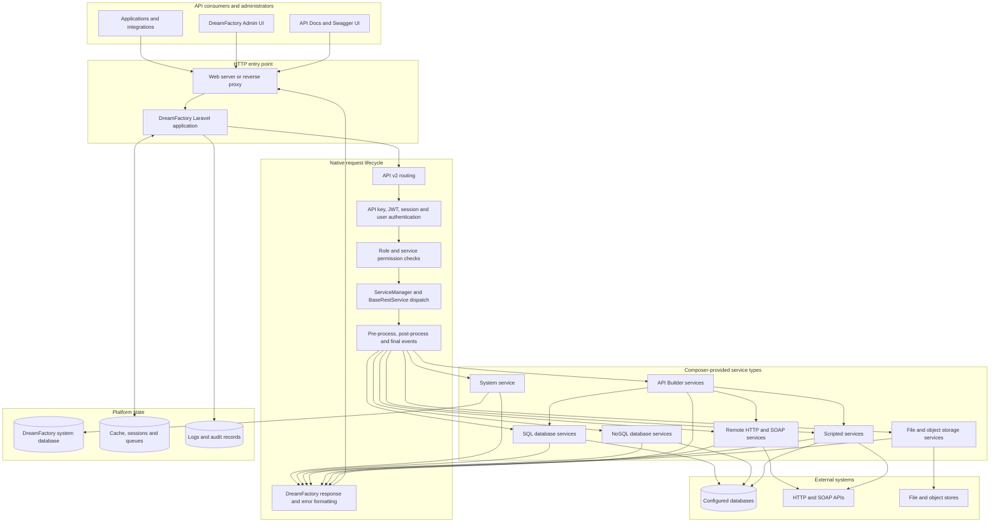

# DreamFactory Original Architecture

This diagram represents the main runtime architecture of DreamFactory 7.7.0
before the proposed named-query and api-query compatibility extensions.

## Architectural Characteristics

- DreamFactory is a Laravel application assembled from Composer packages.
- Service types are registered through Laravel service providers and the
  DreamFactory service manager.
- Authentication, RBAC, events, OpenAPI generation and response handling are
  shared platform capabilities.
- Service configuration, roles, applications and API metadata are stored in
  the DreamFactory system database.
- Database services expose standard resources such as tables, schemas,
  procedures and functions.
- The Admin UI consumes the same system APIs used by automation.
