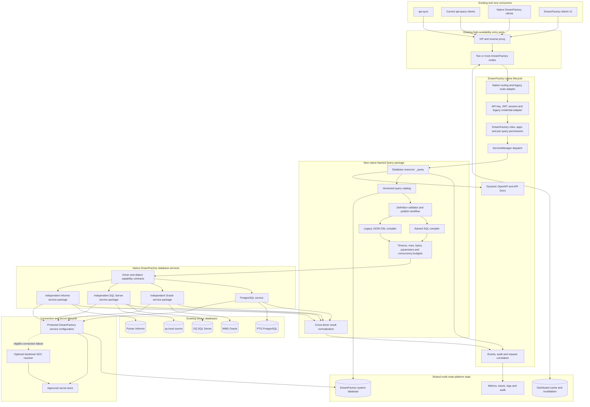

# Target DreamFactory Architecture for API Query

This is the target architecture for replacing api-query without creating a
permanent sidecar or a parallel administration and authorization platform.
All new capabilities remain inside the native DreamFactory lifecycle.

## Target Design Rules

- `_query` is a native child resource of DreamFactory SQL services.
- Query definitions reference an existing DreamFactory service by stable ID;
  they never duplicate database passwords.
- Existing api-query routes and headers are implemented by an internal
  compatibility adapter and can be retired after consumer migration.
- Native DreamFactory roles, applications and API keys remain the source of
  authorization truth.
- SQL and JSON definitions are validated and published as versioned metadata.
- Request values are always bound parameters and never SQL fragments or
  identifiers.
- Execution budgets apply across statements and JSON DSL subqueries.
- OpenAPI, events, audit, Admin UI and cache invalidation use DreamFactory's
  existing extension points.
- Oracle, SQL Server and Informix connectors are independently implemented
  from Apache-licensed interfaces and vendor documentation.
- The proprietary DreamFactory connector implementations are not source
  material for the independent packages.
- All nodes share the system database and distributed invalidation mechanism;
  sticky sessions are not required.
